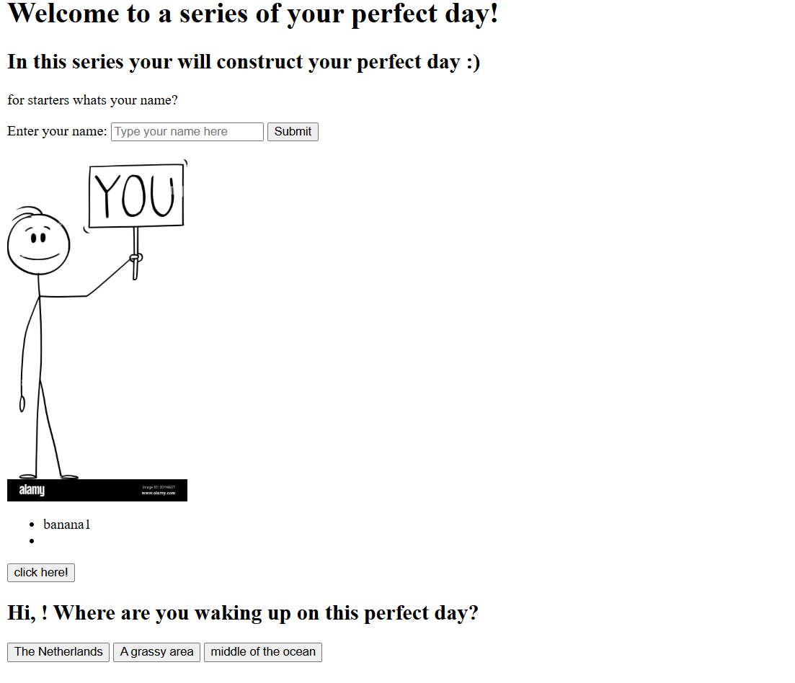

*My.website* 
<Title> My Website </Title>
My website is a interactive website where the program acts as your friend, it asks you questions about your day as well a preferences which would make it your ideal 'perfect day'. 
Some of the buttons don't work however I have been working with some other participants to try and solve it - vivienne Chen was my partner who helped me the most and we acutally did make a lot of progress with the syntax so I think there might be a logic error in this case. 
The exact buttons which dont work are the: 
- best place to wake up buttons
- the activity based on location buttons 
- the companian 
and the summary is not working, becuase there was a problem with storing the buttons into variables which can be taken later and addedd into the final summary, however you can click on the buttons and for the "click here" button it does show an error notification when you open it. The enter name and submit button also works - I tried to use a different format in making the different variables and buttons, so that might be the problem. Instead of sticking to one method I tried to learn different ways to import buttons. 

This is the image: 

This is the link to the demo pages: 
https://chrisann24.github.io/sunbeam-website/ 
